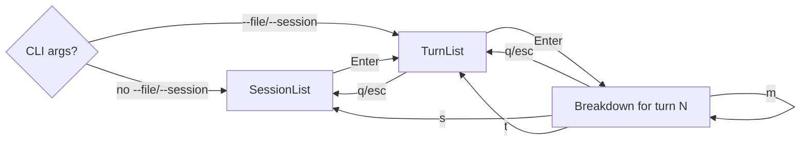

# `ctx-analyzer inspect` — TUI Wireframes (SSOT)

This directory is the **single source of truth** for the `ctx-analyzer inspect`
TUI layout. All component / render code under `src/cli/tui/` must follow these
wireframes; if a screen needs to change, update the wireframe first, then the
code.

## Stage navigation

The interactive flow is a 3-stage stack:

- `q` / `Esc` pops one stage. From the bottom stage it quits.
- `s` / `t` jump from any stage.
- When the binary is launched with `--file` or `--session`, the bottom stage is
  `TurnList` (popping it quits).

## File index

| File                                           | Stage / Surface              |
| ---------------------------------------------- | ---------------------------- |
| [session-list.md](./session-list.md)           | Stage 1 — pick a session     |
| [turn-list.md](./turn-list.md)                 | Stage 2 — pick a turn        |
| [context-breakdown.md](./context-breakdown.md) | Stage 3 — per-turn layers    |
| [preview-modal.md](./preview-modal.md)         | Overlay — full payload text  |
| [help-modal.md](./help-modal.md)               | Overlay — keymap reference   |
| [warning-modal.md](./warning-modal.md)         | Overlay — non-fatal warnings |
| [key-bindings.md](./key-bindings.md)           | Cross-stage keymap table     |

## Rendering conventions

- ASCII frames use the same box-drawing characters that ratatui draws
  (`┌ ┐ └ ┘ ─ │ ▾ ▸ ·`). Selection cursor is `>` placed in the leftmost
  column slot.
- Token magnitudes are prefixed with `~` and grouped with thousand separators
  (`~12,400`). Severity glyphs (`!` high, `!!` critical, `?` unknown) follow
  the number.
- Path columns are middle-truncated with `…` when the column overflows.
  Source: `crate::utils::text::truncate_chars` and the per-screen widths in
  each wireframe.
- Relative timestamps (`30 sec ago`, `2 min ago`, …) are rendered with the
  helper that lives next to the components (no chrono humantime crate is
  introduced for the MVP).
- The footer hint line is mode-specific and matches `key-bindings.md`.

## Mouse

- Mouse capture is enabled at startup. Components register clickable regions
  for **path spans** (Breakdown detail rows, Preview Modal `Source:` line,
  Header workspace path). Left-click on a registered region triggers the
  same code path as `o` (open in `$EDITOR`).
- When a terminal does not forward mouse events, all flows remain reachable
  via the keyboard.
